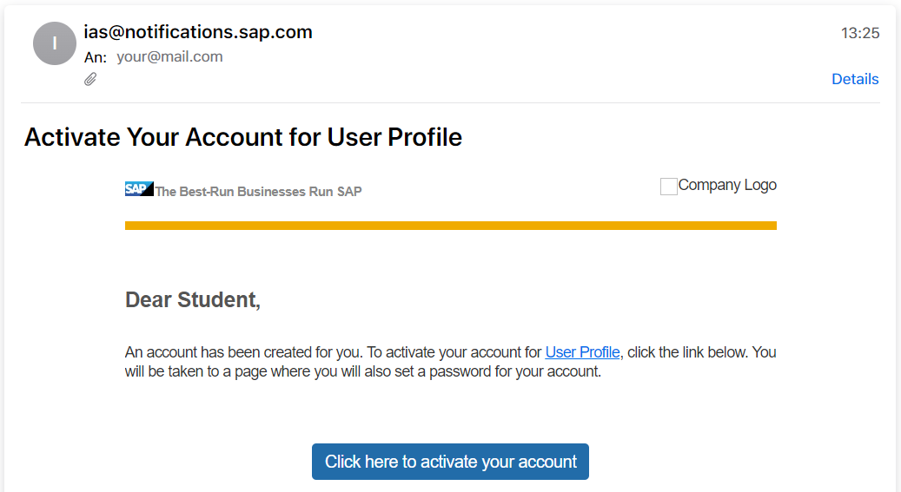
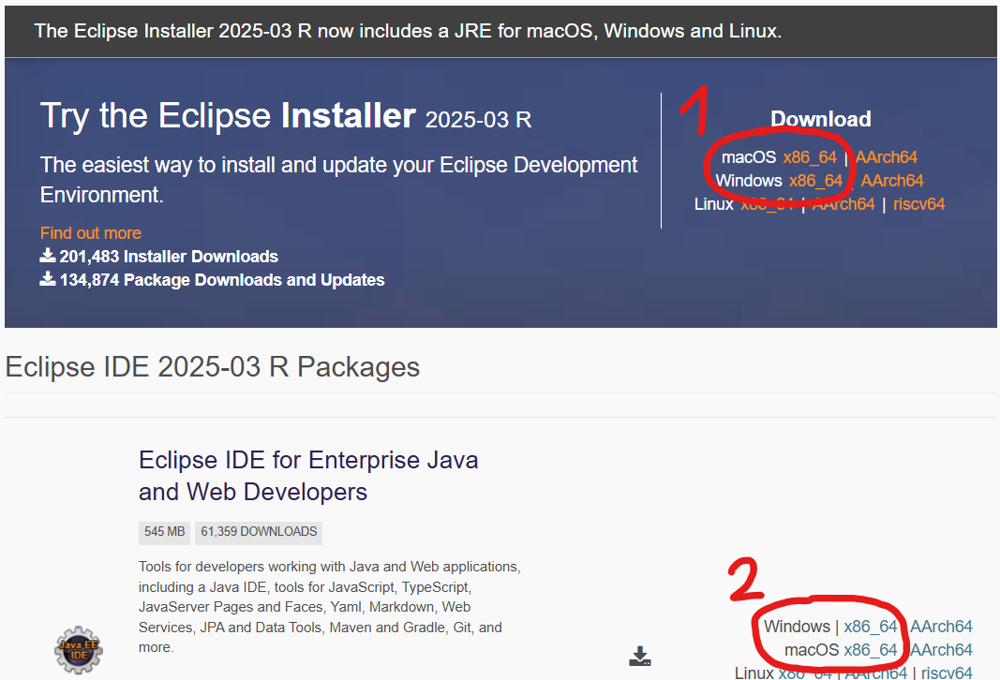
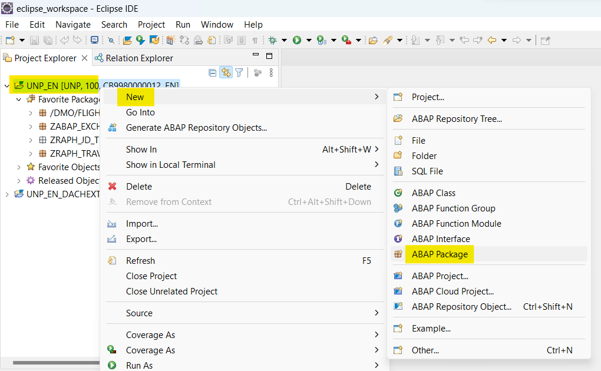
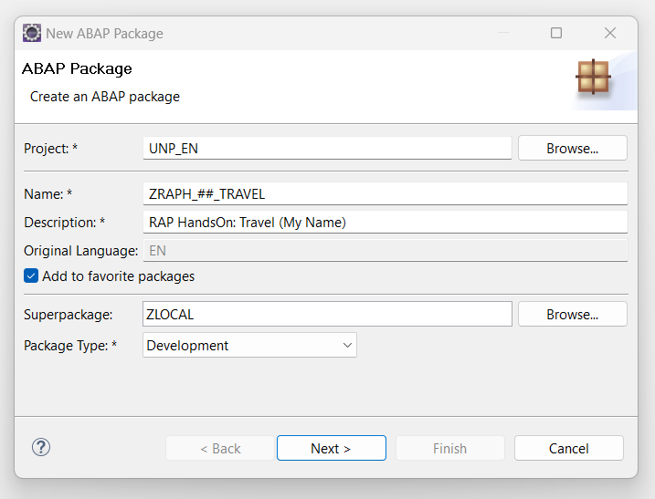
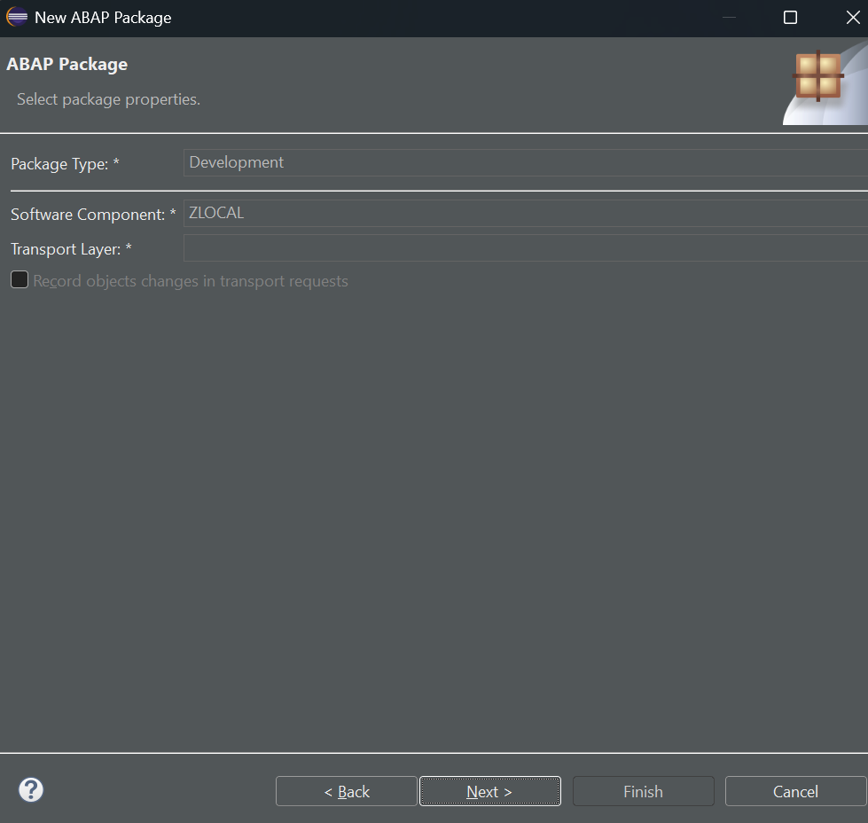
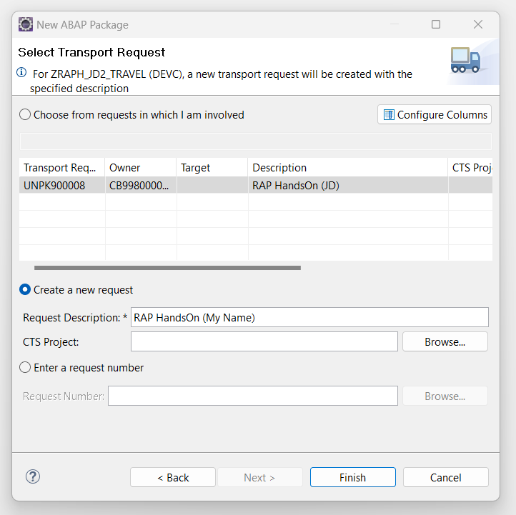

# Installation Guide: ABAP Environment, Eclipse and BAS

## Preparing for the ERP Praktikum
For our course we will rely on SAP's Business Technology Platform ABAP Environment. To get ready for developing we have to set up some things first:  
1. [Activate msg ABAP Environment User (~5min)](#markdown-header-1-activate-msg-abap-environment-user)  
2. [Install Eclipse with necessary plugins (~20min)](#markdown-header-2-install-eclipse-with-necessary-plugins)  
3. [Add the development system as ABAP Cloud Project to Eclipse (~5min)](#markdown-header-3-add-the-development-system-as-abap-cloud-project-to-eclipse)   
4. [Install SAP Business Application Studio (~10min)](#markdown-header-4-install-sap-business-application-studio)  
5. [Connecting BAS with the ABAP Environment (~2min)](#markdown-header-5-connecting-bas-with-the-abap-environment)

### 1. Activate msg ABAP Environment User
[^ Top of page](#)  
You should have gotten an activation link via mail (already at the beginning of the week) and simply have to click the shiny blue button:

Afterwards, you'll have to set a password for your SAP user.  
Please remember it (:

### 2. Install Eclipse with necessary plugins
[^ Top of page](#)  
Next, we have to install the local development environment. For this, SAP switched from their own solution to the Eclipse IDE with an ABAP Development Tool plugin.  

  
#### ATTENTION FOR MAC USERS  
**Please [continue here](InstallationMac.md), if you have an Apple Macintosh!**  

#### Installation Guide for Windows 

>**Note** Even if you already happen to have Eclipse installed we urge you to install it again due to compatibility reasons with the Eclipse and ADT versions together with BTP Trial. Even if you have older Eclipse + ADT Installations, setup a new one as only the latest state is expected to work properly over the course.

>**Note** You'll probably have to **leave any VPN** (e.g., from msg or the university)! The connection to Eclipse's plugin repository may fail otherwise.

Go to [Eclipse 2025-12](https://www.eclipse.org/downloads/packages/release/2025-12/r) and download the version fitting your operating system.  

>**Note** There are two different options: The option **1** at the top offers a **guided installer**. Option **2** at the bottom allows you to download an **archive** (.zip) which simply has to be unpacked on your computer. The latter might be the easier option based on your liking and includes the ready-to-use Eclipse app. Anyways, you can choose your preferred option yourself.  

 

When the installation finished you can launch Eclipse.  
You will be asked for a workspace and can store the presetting as default.

>**Note** You may have to **run Eclipse as administrator** on Windows in order to install add-ons.

Now we'll install the ABAP Development Tools (ADT): Click *Help* > *Install new Software...* in Eclipse and enter `https://tools.hana.ondemand.com/latest` into the field *Work with*. Click *Add...* and store the plugin URL under the name *ADT*. After adding, the available tools will be loaded. Active the checkbox for *ABAP Development Tools* and click on *Next >*. On the following page again *Next >*, then accept the license terms and click *Finish*. You'll see the installation progress in the lower right corner of Eclipse. In some cases you have to explicitly state that you're trusting the signers SAP and Eclipse.  

After the installation Eclipse has to be restarted. Close the welcome tab and open the ABAP perspective by clicking *Window* > *Perspective* > *Open Perspective* > *Other* > *ABAP*.  

### 3. Add the development system as ABAP Cloud Project to Eclipse
#### Connecting Eclipse with BTP
[^ Top of page](#)  
>We're using a development system hosted by SAP in "the Cloud", i.e. SAP Business Technology Platform (SAP BTP, ABAP Environment).  
>Our system version is _ABAP IN SAP CLOUD PLATFORM 2602 (HFC 5)_, the newest currently available release from February 2026.  
>**Note** Our ABAP system _UNP_ is configured to be only **available March 9th to April 10th weekdays from 8 to 18 o'clock**.  
>**Also, it will be online Saturday and Sunday, from 8 to 18 o'clock.**  
>**The system will shut down once the exam has concluded on April 10th.**  
 

Now we will add this system as ABAP Cloud Project in Eclipse. If you have already opened the ABAP perspective before you are already good to go: Click on *Create an ABAP Cloud Project* in the *Project Explorer* on the left.  

Here you have to provide the ABAP Service Instance URL `https://12676eb1-e177-428a-a443-55bba6f2216c.abap-web.eu10.hana.ondemand.com` and continue with *Next >*. Now you'll have to logon to your SAP BTP Account by clicking *Open Logon Page in Browser*. Here you have to select `ahg2zqgbd.accounts.ondemand.com` and provide the mail and passwort you chose in the first step. Back in Eclipse use *EN* as logon language when asked and click *Finish*.

#### Creating a development package
You've successfully connected your development IDE with the ABAP Environment in the Business Technology Platform. Next, we will create a package and associated transport request. This package will be used to store all your development objects which we'll create during this course. To do so, right click on your new ABAP Project *UNP* and select *New* > *ABAP Package*.

  

On the *Next >* wizard page, assign the Name `ZRAPH_##_TRAVEL` where the `##` has to be replaced with your personal *initials*. This ensures that everybody has his own package and we don't interfere with each others - we'll use the `##` throughout the course! The superpackage will stay *ZLOCAL* and you should check the box to save this as favorite package for easier access before continuing with *Next >*.  

>**Important!** In case your `##` two-digit initials are already used by another student: Please **choose another two-digit combination** like, e.g. `M2` instead of `MM` for Max Mustermann. **Three-digits combinations should NOT be used!** Due to development object name length restrictions, you'll run into problems otherwise.  

On the second wizard screen you can leave everything as is and just continue with *Next >*.  
  

Finally, select the radio button *Create a new request* where you should provide some meaningful *Request Description* and can complete the wizard by pressing *Finish*. This transport request is required as you would normally e.g. transport such packaged changes from a development to a test system. In our case this won't happen but is necessary nontheless.

With this, you've completed the third preparation step.

### 4. Install SAP Business Application Studio 
[^ Top of page](#)  
Our final step is to configure the Business Application Studio (BAS) which is the development environment for the FrontEnd. Here, our browser applications will be implemented later on.  

To get started, open the [Business Application Studio](https://uni-passau-sbx-tdd.eu10cf.applicationstudio.cloud.sap/index.html). If asked, select *ahg2zqgbd.accounts.ondemand.com* for signing in. Once the BAS has opened, you'll have to click *Create Dev Space*: Select the name *Fiori* and the application type *SAP Fiori* and click on *Create Dev Space*. Your Dev Space will automatically be started - this may take some minutes. Meanwhile you can store a browser bookmark for the BAS. Once it's *running*, open the Dev Space.

### 5. Connecting BAS with the ABAP Environment 
[^ Top of page](#)  
Now we'll have to connect the BAS with Cloud Foundry in order to use OData services from the BackEnd in our FrontEnd app. Therefore, open [BAS](https://uni-passau-sbx-tdd.eu10cf.applicationstudio.cloud.sap/index.html) again via your browser bookmark and open your Fiori Dev Space.  

Click on the *hamburger menu* in the top left corner and select *Terminal* > *New Terminal...*. Type `cf login --sso` into the opened editor and confirm via *Enter*. Paste the API endpoint `https://api.cf.eu10-004.hana.ondemand.com` and confirm via Enter. You'll get a link in order to retrieve a temporary passcode for logging in - open this URL from the BAS Terminal via `Ctrl + Click` and enter `ahg2zqgbd-platform` as origin key, click the second button. You will get a passcode afterwards (but might have to login again with user and password).  

Copy this passcode, paste it back into the BAS Terminal and click `Enter`. You won't see that the passcode was pasted, the input field will remain empty. Just be confident of yourself and press `Enter` anyways! You should get a green *OK* message in the Terminal and are finally good to go.

Basically, everything is ready now - congratulations!  
**We're looking forward to seeing you on March 16th :)**

## Further Links
- [Eclipse Keyboard Shortcuts](Shortcuts.md)

