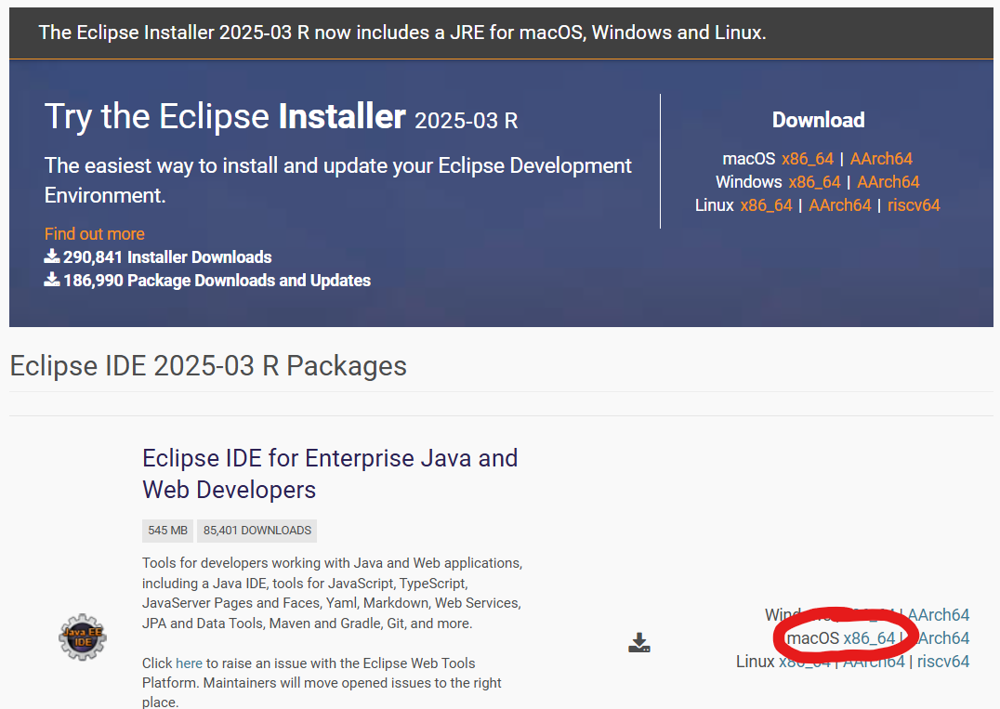
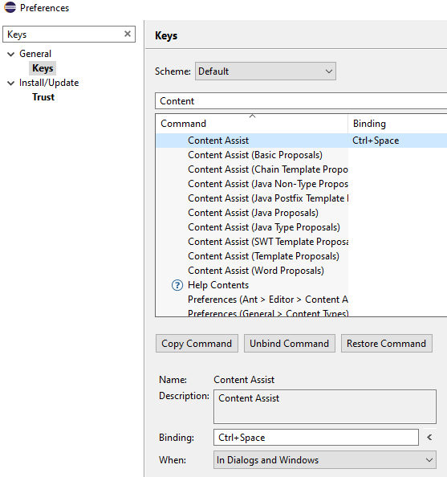

# Installation Guide: ABAP Environment, Eclipse and BAS

### 2. Install Eclipse with necessary plugins for Macs
**Please notice the information for Macs below BEFORE opening** the Eclipse.app for the first time. Even if you never had problem with third-party-apps on your Mac, **Eclipse is different!**  

>**Note** Even if you already happen to have Eclipse installed we urge you to install it again due to compatibility reasons with the Eclipse and ADT versions together with BTP Trial. Even if you have older Eclipse + ADT Installations, setup a new one as only the latest state is expected to work properly over the course.

>**Note** You'll probably have to **leave any VPN** (e.g., from msg or the university)! The connection to Eclipse's plugin repository may fail otherwise.

Go to [Eclipse 2025-12](https://www.eclipse.org/downloads/packages/release/2025-12/r) and download Eclipse IDE for Enterprise Java and Web Developers for macOS x66_64:  

>**Note** This will download an **archive** (.dmg) which simply has to be unpacked on your computer. Unzip the downloaded archive and move Eclipse.app to the folder `Macintosh HD/Applications`.  

### DON'T OPEN ECLIPSE, YET !!!   
We'll have to change some settings **directly after installing Eclipse and BEFORE opening it** as otherwise you won't be able to start Eclipse. It is okay to move Eclipse.app after unzipping the downloaded dmg-file to your Applications folder. But **please do not execute Eclipse.app**, yet!

The app will self-modify itself during the first startup. This will lead to Eclipse not starting again as the built-in [macOS Gatekeeper XProtect](https://support.apple.com/guide/security/protecting-against-malware-sec469d47bd8/web) prevents starting Eclipse after its self-modification (this is considered as security threat).  

**Therefore, we have to define an [exception](https://stackoverflow.com/questions/70262544/eclipse-quit-unexpectedly-on-macos) in the Terminal**.

- Make sure that you have moved Eclipse.app to the directory `Macintosh HD/Applications`
- Open the Terminal and execute the command `cd /` to change to the user root directory
- Execute `xattr -r -d com.apple.quarantine /Applications/Eclipse.app`. Don't expect an answer from the Terminal, you sadly won't get any. Nonetheless, you're now safe to start Eclipse (from `Macintosh HD/Applications`).

When the installation finished you can launch Eclipse.  
You will be asked for a workspace and can store the presetting as default.

Now we'll install the ABAP Development Tools (ADT): Click *Help* > *Install new Software...* in Eclipse and enter `https://tools.hana.ondemand.com/2025-03/` into the field *Work with*. Click *Add...* and store the plugin URL under the name *ADT*. After adding, the available tools will be loaded. Active the checkbox for *ABAP Development Tools* and click on *Next >*. On the following page again *Next >*, then accept the license terms and click *Finish*. You'll see the installation progress in the lower right corner of Eclipse. In some cases you have to explicitly state that you're trusting the signers SAP and Eclipse.  

After the installation Eclipse has to be restarted. Close the welcome tab and open the ABAP perspective by clicking *Window* > *Perspective* > *Open Perspective* > *Other* > *ABAP*.

Eclipse somehow hasn't preconfigured the keyboard shortcut for _Content Assist_ on Macs. To activate it, go to the following menu bar settings: _Eclipse_ > _Settings / Preferences_. Search for _Keys_ in the menu pop-up and select the corresponding menu. Here, provide _Shift_ + _Space_ as _Binding_ for the entry _Content Assist_ and save:  
  

### 3. Add the development system as ABAP Cloud Project to Eclipse 
Now we'll go back to the [main installation guide](Installation.md#markdown-header-3-add-the-development-system-as-abap-cloud-project-to-eclipse).
